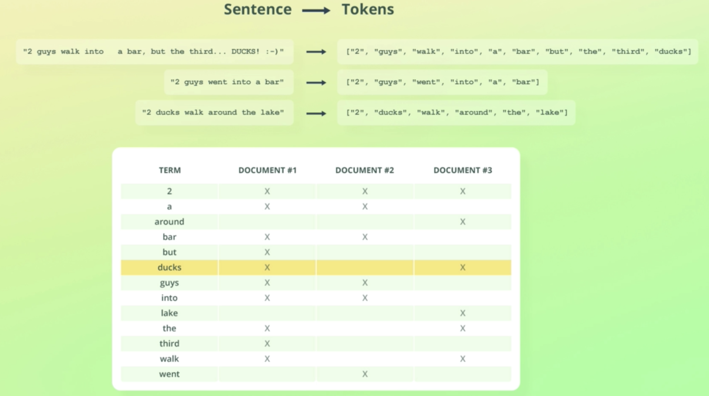

# Key Words

- Analyzer

  - character filters
  - Tokenizer
  - token filters

- Inverted Indices
  - TERM

### Analyzer


```
// command
POST /_analyze
{
  "text": "2 guys walk into   a bar, but the third... DUCKS! :-)",
  "analyzer": "standard"
}

// custom character filter, tokenizer and token filters
POST /_analyze
{
  "text": "2 guys walk into   a bar, but the third... DUCKS! :-)",
  "char_filter": [],
  "tokenizer": "standard",
  "filter": ["lowercase"]
}

// result
{
  "tokens" : [
    {
      "token" : "2",
      "start_offset" : 0,
      "end_offset" : 1,
      "type" : "<NUM>",
      "position" : 0
    },
    {
      "token" : "guys",
      "start_offset" : 2,
      "end_offset" : 6,
      "type" : "<ALPHANUM>",
      "position" : 1
    },
    {
      "token" : "walk",
      "start_offset" : 7,
      "end_offset" : 11,
      "type" : "<ALPHANUM>",
      "position" : 2
    },
    {
      "token" : "into",
      "start_offset" : 12,
      "end_offset" : 16,
      "type" : "<ALPHANUM>",
      "position" : 3
    },
    {
      "token" : "a",
      "start_offset" : 19,
      "end_offset" : 20,
      "type" : "<ALPHANUM>",
      "position" : 4
    },
    {
      "token" : "bar",
      "start_offset" : 21,
      "end_offset" : 24,
      "type" : "<ALPHANUM>",
      "position" : 5
    },
    {
      "token" : "but",
      "start_offset" : 26,
      "end_offset" : 29,
      "type" : "<ALPHANUM>",
      "position" : 6
    },
    {
      "token" : "the",
      "start_offset" : 30,
      "end_offset" : 33,
      "type" : "<ALPHANUM>",
      "position" : 7
    },
    {
      "token" : "third",
      "start_offset" : 34,
      "end_offset" : 39,
      "type" : "<ALPHANUM>",
      "position" : 8
    },
    {
      "token" : "ducks",
      "start_offset" : 43,
      "end_offset" : 48,
      "type" : "<ALPHANUM>",
      "position" : 9
    }
  ]
}
```

## Inverted Indices

> The reason the index is called an inverted index is just that the more logical mapping would be to have a mapping from documents to the terms they contain, i.e. the other way around. That doesn't provide the fast lookups that we need, so that's why the relationship is inverted.


